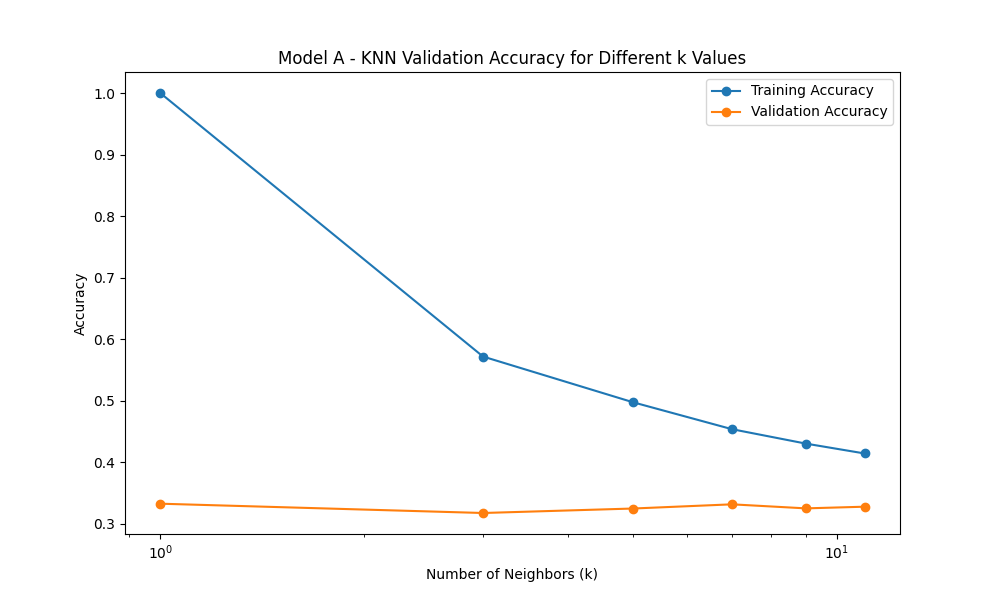
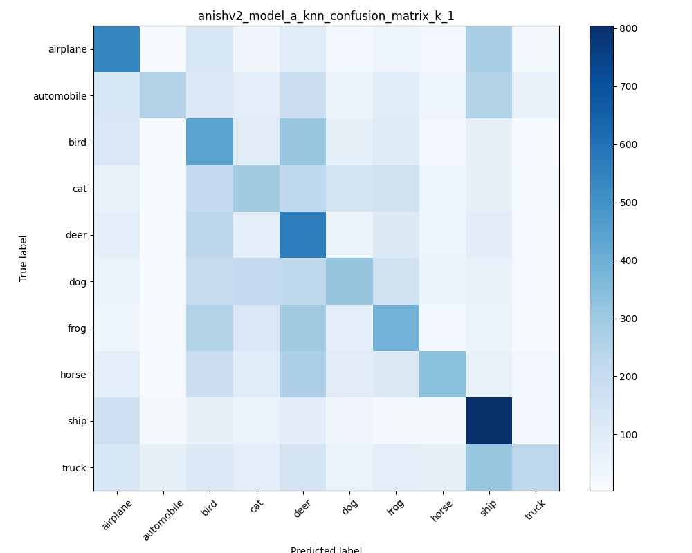
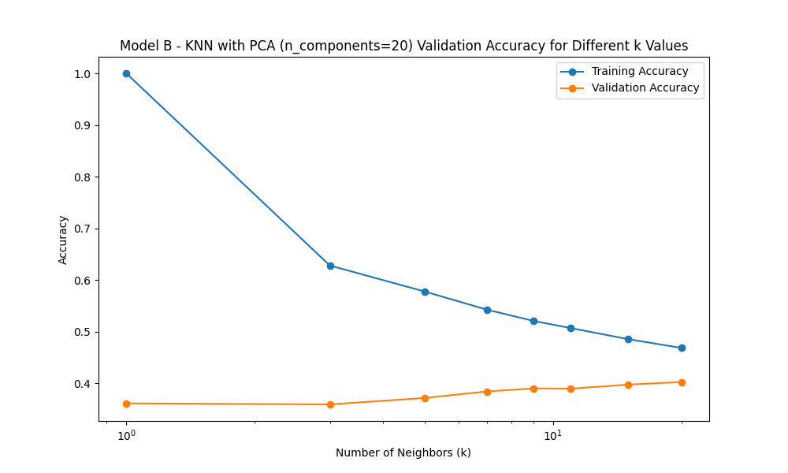
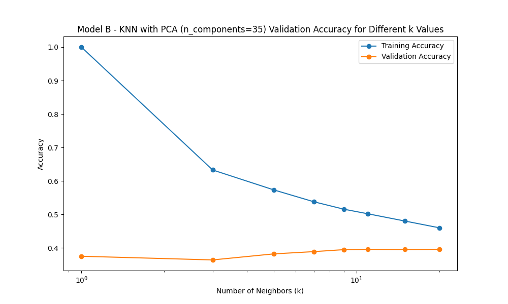
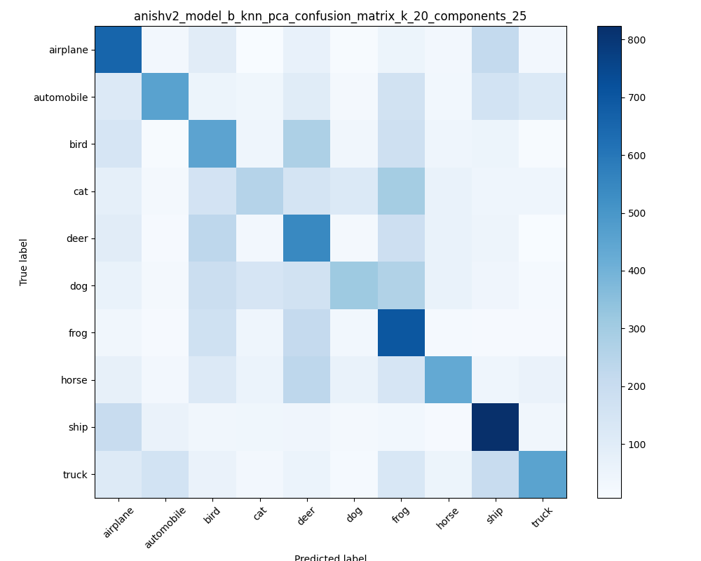

# anishv2 kNN Final Results

## Overview
In this notebook, we will be training two models (kNN and kNN with PCA) and determine its accuracy on the CIFAR-10 Dataset. In this section, we will be training the kNN model with the aforementioned dataset and examine the metrics of the model.

## Understanding the data

In this notebook, we have conducted a training, validation, and test split with each set serving different purposes. The training set is utilized to fit the kNN models. Predictions will then be made using validation and hyperparameters would be finetuned to improve the accuracy on the validation set. Finally, the testing set will be used as final determination of the models' accuracy.

This notebook conducts **75/25 split on the training data**
| Set | % of data |
|---|---|
| Training | 62.5% |
| Validation | 20.8% |
| Testing | 16.7% |

Below two models are being trained: 
1. A Simple KNN classifier.
2. KNN classifier with Principal Component Analysis (PCA)

## Why use Principal Component Analysis?

kNN models are known to struggle with high dimensionality as distances between all points become roughly uniform. This occurs because the available data becomes sparse in these high dimensions as the volume of space increases rapidly. This is known as the **curse of dimensionality** and affects distance-based models such as kNN. Principal Component Analysis reduces dimensionality by focusing on the axises with the largest variance. Later, in this notebook, we will investigate the results of PCA by comparing it with the base kNN model.

## Evaluating Model A with Validation Set

Using the validation set, we will fine-tuned the k nearest neighbors hyperparameter by testing the accuracies of different ks.

`Best k value for Model A: 1 with Validation Accuracy = 0.3330`
*This was determined by the highest point in validation accuracy*

As you can see, despite an optimized k value, the accuracy is approximately 33%. This is because CIFAR-10 dataset consists of 3072 dimensions which results in the kNN suffering from the curse of dimensionality. Looking at a confusion matrix and classification report can help us examine the issue. 

From this confusion matrix, we can see two major feature: the apparent bias towards ships and the cluster in the animal section. Since kNN is a distance-based models and relies on raw pixel values, the kNN can get distracted by characteristics such as background color instead of actual features (e.g. the bow of a ship). This is shown heavily in the ship row where truck, automobile, and airplane are being misclassified as ships due to their blue background color. 

This is further shown with cluster in the center which classifies animals. The kNN model cannot extract features of animals such as antlers for deers and relying heavily on color distribution due to pixel-wise distances. Since most animals follow a similar color distributions, the graph showcases a blurry cluster for animals.  

Classification Report for Model A - KNN (k=1):
| Class       | Precision | Recall | F1-Score | Support |
|------------|----------|--------|----------|---------|
| airplane   | 0.39     | 0.45   | 0.42     | 1187    |
| automobile | 0.66     | 0.20   | 0.31     | 1251    |
| bird       | 0.23     | 0.36   | 0.28     | 1240    |
| cat        | 0.26     | 0.24   | 0.25     | 1228    |
| deer       | 0.24     | 0.45   | 0.31     | 1244    |
| dog        | 0.35     | 0.25   | 0.29     | 1276    |
| frog       | 0.31     | 0.31   | 0.31     | 1252    |
| horse      | 0.51     | 0.27   | 0.36     | 1246    |
| ship       | 0.39     | 0.62   | 0.48     | 1301    |
| truck      | 0.56     | 0.18   | 0.27     | 1275    |
| **Accuracy** |          |        | **0.33** | 12500   |
| **Macro Avg** | 0.39     | 0.33   | 0.33     | 12500   |
| **Weighted Avg** | 0.39     | 0.33   | 0.33     | 12500   |

Looking at the classification report, we can see the same issue. We can see that the animal group has both low precision and recall reinstating the fact that the model is unable to extract characteristics of animals. For ship, with the high recall and low precisions, we can understand the model often characterizes images (high recall) likely due to the blue background, but does prediction that it is actually a ship is mostly incorrect (low precision). The inverse (high precision, low recall) is seen in car and truck as most of time it is being classified as ship, but when it is classified as the class it is mostly correct.

## Evaluating Model B with Validation Set
Using the validation set, we can examine the most optimal amount of primary components. This will help reduce any noisy features by taking in consideration the variation. We will also find the optimal k value to prevent overfitting.

| PCA components | K Value Vs Accuracy|
|---|---|
| 10 |  |
| 20 |  |
| 25 |  |
| 30 |       |
| 35 |       |
| 40 |       |
| 50 |       |

`Best PCA components for Model B: 25 with k=20 and Validation Accuracy = 0.4066`
*This was determined by the highest point in validation accuracy*

As you can see with the model with hyperparameters `n_components=25, k=20` obtain an validation accuracy of approximately 41%. This is a 8% increase from the base KNN model showcasing its impact. To understand this increase, let's examine a confusion matrix and classification report. 

By conducting Primary Component Analysis, the ship bias that was on the base KNN is resolved. This is due to it removing the noise like the dark blue background and focuses on the features that matter such as the pixels for the bow of the ship, or the wing of a plane.We can see however that the animal cluster is still present showcasing that the model is unable to properly extract features for animals such as cat and dog. Compared to the base KNN animal cluster, however, it is more accurate in predicting unique animals such as deer, bird, and frog.

To further examine the strength and weakness of the model we can look at the classification report's recall and precision. Recall measures the ability of the model to reduce false negative classifications, while accuracy focuses on reducing false positive.

Classification Report for Model B - KNN with PCA (n_components=25, k=20):

| Class       | Precision | Recall | F1-Score | Support |
|------------|----------|--------|----------|---------|
| airplane   | 0.42     | 0.55   | 0.47     | 1187    |
| automobile | 0.56     | 0.37   | 0.44     | 1251    |
| bird       | 0.29     | 0.36   | 0.32     | 1240    |
| cat        | 0.37     | 0.21   | 0.27     | 1228    |
| deer       | 0.30     | 0.44   | 0.35     | 1244    |
| dog        | 0.47     | 0.24   | 0.32     | 1276    |
| frog       | 0.33     | 0.56   | 0.41     | 1252    |
| horse      | 0.54     | 0.35   | 0.42     | 1246    |
| ship       | 0.50     | 0.63   | 0.56     | 1301    |
| truck      | 0.57     | 0.36   | 0.44     | 1275    |
| **Accuracy** |          |        | **0.41** | 12500   |
| **Macro Avg** | 0.43     | 0.41   | 0.40     | 12500   |
| **Weighted Avg** | 0.44     | 0.41   | 0.40     | 12500   |

In the classification report, we can see a significant improvement in recall for vehicles. Trucks recall was originally at 0.18 and automobile recall was originaly at 0.20. By shrinking from 3072 dimensions to 25 dimensions, the model is not getting distracted by low variant feature. Additionally, you can see a significant improvement in recall for frogs which is due to able to understand the importance of the green spots in a frog.

## Verdict

After testing the data with the final testing data, model A received 34% accuracy while model B achieved 41% accuracy. Glancing at the confusion matrices, we can see that they had a similar result to their validation. Both models did poorly when classifying animal, with the exception of model B's performance on frogs. Model A, additioanlly, did poorly at detecting vehicles and oftentimes classified cars and trucks as ships. 

This consistent improvement from model B showcases the validity of KNN with PCA model and how providing less features is better than including noisy features. Based on the accuracy number and confusion matrix, PCA alone does not solve the curse of dimensionality but mitigates it, as it is still performing under 50%. For better accuracy, we should create a ensemble of models. One such prevalent configuration of models on CIFAR-10 is a convolutional neural network and kNN ensemble. Convolutional neural network or CNN is excellent at image recognition as it uses convolutional filters to detect patterns in the images. By detecting patterns and not individual pixel based values, it also migitates the curse of dimensionality. By combining CNN with KNN with PCA, the model will be able to determine to make more accurate prediction by relying on the features that matter the most. A research paper by Abouelnaga et el from Cornell University utilized this approach to achieve an accuracy of 93.33% to 94.03% on CIFAR-10 dataset. 

## Sources
https://arxiv.org/abs/1611.04905
Abouelnaga, Y., Ali, O. S., Rady, H., & Moustafa, M. (2016, November 15). CIFAR-10: Knn-based ensemble of classifiers. arXiv.org. https://arxiv.org/abs/1611.04905 