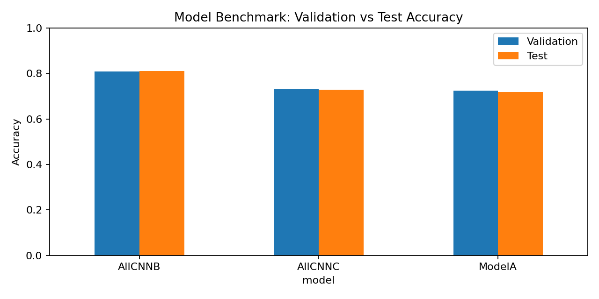
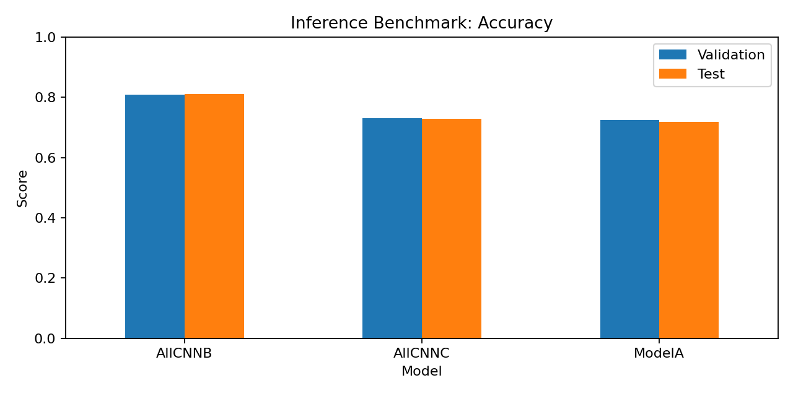
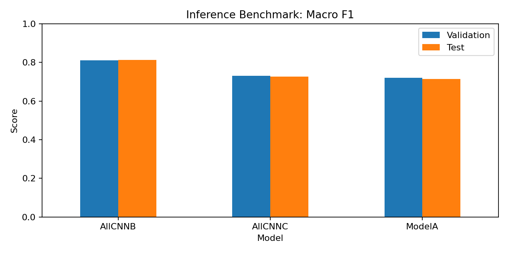
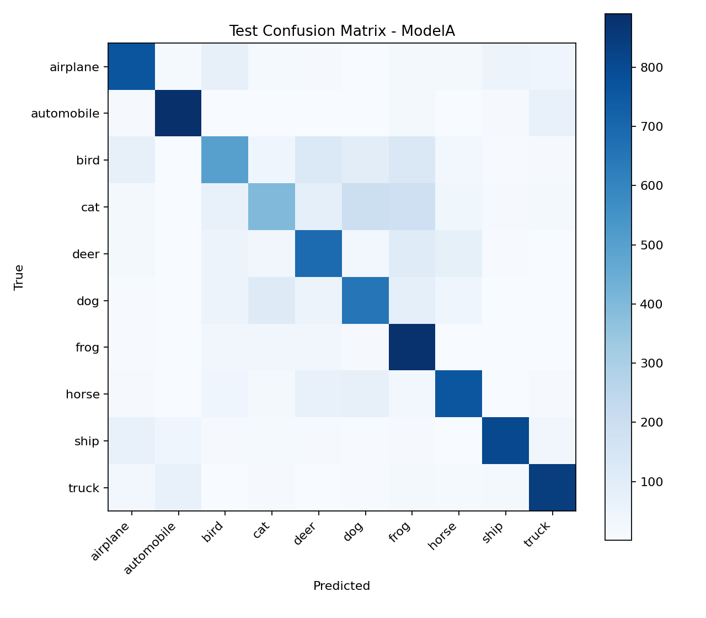
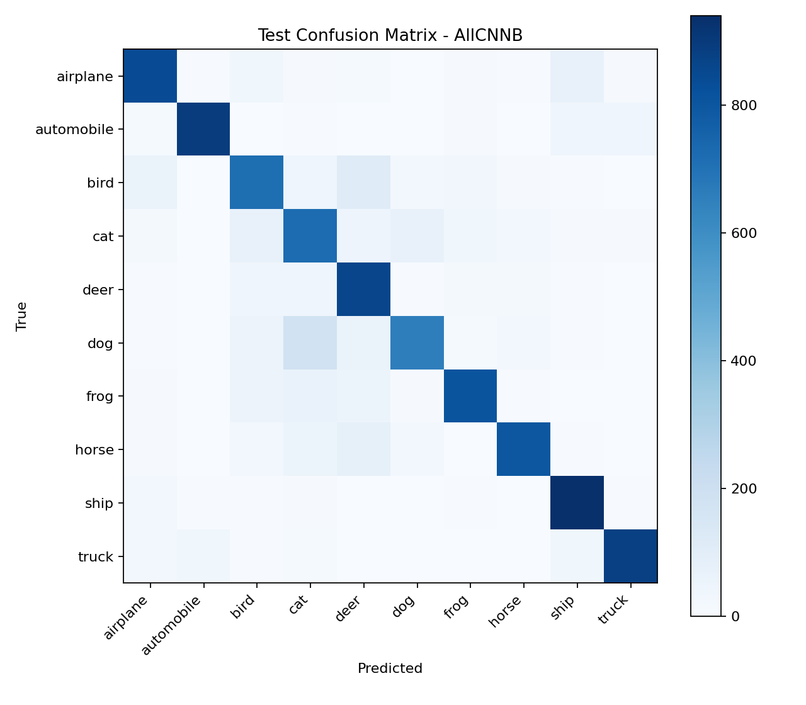
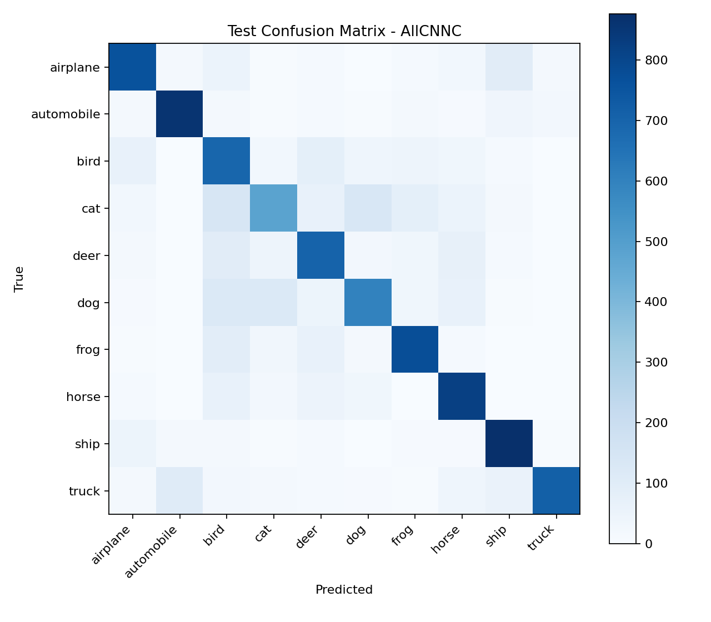

# shahpk1 CNN Final Results

## Overview

Convolutional Neural Networks (CNNs) are machine learning models that automatically learn to recognize visual patterns—starting from simple edges and textures and building up to object parts—directly from labeled images. They do this by scanning the image with small learned filters and progressively summarizing spatial information, making them efficient and robust for tasks like image classification.

## 1) Summary

We evaluated three CNN variants (`ModelA`, `AllCNNB`, `AllCNNC`) on CIFAR-10 using a stratified 75/25 train-validation split inside `data/cifar10/train`, then performed held-out evaluation on `data/cifar10/test` using saved weights only (no retraining in evaluation notebooks). The best model in this run is **AllCNNB**, which led both validation and held-out test macro metrics.

## 2) Experimental Setup

- Development split: stratified 75/25 from `data/cifar10/train`
- Final test split: `data/cifar10/test` (used only for final reporting)
- Selection policy: pick the best validation model, then report one held-out test result
- Metrics: accuracy + macro precision/recall/F1
- Reproducibility seed: `178`
- Reference architecture source: <https://arxiv.org/pdf/1412.6806>

## 3) Architectures and Why They Behaved Differently

This project compares one conventional CNN baseline (`ModelA`) with two all-convolutional variants (`AllCNNB`, `AllCNNC`).

### What each component does (quick reference)

- **Conv2d (3x3):** Each convolution learns local spatial patterns (edges, textures, object parts)
- **ReLU:** adds non-linearity so stacked layers can model complex class boundaries
- **MaxPool / Strided Conv:** reduces spatial size while growing receptive field (it keeps the strongest activations in a region or learns to downsample via stride)
- **Dropout / Dropout2d:** regularizes by randomly dropping activations/channels during training (helping prevent overfitting, preventing the network from relying on specific features too much)
- **1x1 Conv:** channel mixing and class-logit projection at low compute cost (combines features across channels without spatial reduction)
- **Global Average Pooling (AdaptiveAvgPool2d(1,1)):** reduces each channel to one value and limits overfitting from large fully connected heads

### Architecture visualization (high level)

```mermaid
flowchart LR
 A[Input 3x32x32] --> B[Conv 3x3, 48]
 B --> C[ReLU]
 C --> D[Conv 3x3, 48]
 D --> E[ReLU]
 E --> F[MaxPool 2x2]
 F --> G[Dropout2d]
 G --> H[Conv 3x3, 96]
 H --> I[ReLU]
 I --> J[Conv 3x3, 96]
 J --> K[ReLU]
 K --> L[MaxPool 2x2]
 L --> M[Flatten]
 M --> N[Linear 6144→256]
 N --> O[ReLU + Dropout]
 O --> P[Linear 256→10]
```

Figure: **ModelA** uses pooling plus a dense classifier head.

```mermaid
flowchart LR
 A[Input 3x32x32] --> B[Dropout2d]
 B --> C[Conv 3x3, 96]
 C --> D[Conv 3x3, 96]
 D --> E[Conv 3x3, 96, stride 2]
 E --> F[Dropout]
 F --> G[Conv 3x3, 192]
 G --> H[Conv 3x3, 192]
 H --> I[Conv 3x3, 192, stride 2]
 I --> J[Dropout]
 J --> K[Conv 3x3, 192]
 K --> L[Conv 1x1, 192]
 L --> M[Conv 1x1, 10]
 M --> N[Global Avg Pool]
 N --> O[Logits 10]
```

Figure: **AllCNNB** uses learned downsampling and a fully convolutional classifier.

```mermaid
flowchart LR
 A[Input 3x32x32] --> B[Dropout]
 B --> C[Conv 3x3, 96]
 C --> D[Conv 3x3, 96]
 D --> E[Conv 3x3, 96, stride 2]
 E --> F[Dropout]
 F --> G[Conv 3x3, 192]
 G --> H[Conv 3x3, 192]
 H --> I[Conv 3x3, 192, stride 2]
 I --> J[Dropout]
 J --> K[Conv 3x3, 192]
 K --> L[Conv 1x1, 192]
 L --> M[Conv 1x1, 10]
 M --> N[Global Avg Pool]
 N --> O[Logits 10]
```

Figure: **AllCNNC** is architecturally similar to AllCNNB in this implementation, but differs in the achieved optimization outcome.

### Component-level comparison

| Model | Downsampling mechanism | Classifier head | Regularization style | Expected behavior |
|---|---|---|---|---|
| ModelA | MaxPool layers | Flatten + FC layers | Dropout2d + Dropout | Stable baseline; lower representational flexibility |
| AllCNNB | Strided 3x3 convolutions | 1x1 conv + global average pooling | Interleaved dropout in conv stack | Better class-discriminative conv features and stronger generalization |
| AllCNNC | Strided 3x3 convolutions | 1x1 conv + global average pooling | Similar dropout strategy | High capacity but more sensitive to optimization settings |

### ModelA (baseline CNN)

`ModelA` uses two convolutional blocks with max-pooling to gradually reduce the size of the feature maps. After the convolutional layers, it flattens the features and passes them through a fully connected layer for classification. The convolutional layers learn image patterns, edges, textures, etc, while the connected layers keep the strongest activations relevant and help prevent overfitting. This model is a strong baseline but may not capture as rich spatial features as the all-convolutional variants.

For hyperparameter tuning, we tried different learning rates, dropout rates, and batch sizes. The best validation performance was achieved with a learning rate of `0.01`, a dropout rate of `0.2`, and a batch size of `128`. However, even with tuning, `ModelA` did not outperform the all-convolutional variants, indicating that its architectural limitations may have capped its performance on this dataset.

### AllCNNB (selected)

`AllCNNB` replaces explicit pooling with learned `strided convolutions` (which reduce the spatial size) and ends with `1x1` conv + global average pooling. The downsampling helps the convolutions to compress spatial information while retaining important features. The 1x1 convolution mixes information across channels, and global average pooling once again reduces all the channels into a single value for classification. In this run, that design produced the best balance of trainability and feature quality, resulting in the highest validation and test performance.

### AllCNNC

`AllCNNC` is also all-convolutional and expressive, but deeper/more sensitive under the current schedule, as such hyperparameter tuning becomes more important, and this was the exact architecture used in the paper, and finding the right sets of hyperparameters was crucial. It learned useful features but did not surpass `AllCNNB` in this training configuration, indicating that architecture capacity alone was not enough without better hyperparameter matching.

## 4) Benchmark Results

| Model | Val Acc | Val Precision (macro) | Val Recall (macro) | Val F1 (macro) | Test Acc | Test Precision (macro) | Test Recall (macro) | Test F1 (macro) |
|---|---:|---:|---:|---:|---:|---:|---:|---:|
| **AllCNNB** | **0.8086** | **0.8169** | **0.8086** | **0.8096** | **0.8113** | **0.8186** | **0.8113** | **0.8122** |
| AllCNNC | 0.7299 | 0.7404 | 0.7299 | 0.7302 | 0.7276 | 0.7362 | 0.7276 | 0.7271 |
| ModelA | 0.7234 | 0.7236 | 0.7234 | 0.7193 | 0.7185 | 0.7204 | 0.7185 | 0.7139 |

## 5) Benchmark Visuals (Linked)

### Test-set comparison plots

### Inference-only benchmark plots (saved-weight evaluation)

### Test confusion matrices

## 6) Final Model Choice

- Selected model: **AllCNNB**
- Validation accuracy: **0.8086**
- Held-out test accuracy: **0.8113**
- Held-out test macro precision/recall/F1: **0.8186 / 0.8113 / 0.8122**

This is because it achieved the best validation performance and also led the held-out test metrics, indicating that it generalizes better to unseen data compared to the other variants under the current training configuration.

## 7) Why we think AllCNNB Won in This Run

`AllCNNB` performed best because its design aligns well with the CIFAR-10 scale and the training setup used here:

1. **Learned downsampling instead of fixed pooling:**
 Strided convolutions retain learnable parameters during spatial reduction, often preserving discriminative detail better than static pooling.
2. **Fully convolutional classification path:**
 The 1x1 conv produces class-specific feature maps and the global average pooling, which helped reduce overfitting from large fully connected layers, which may have been a factor in `ModelA`'s lower performance. For ModelC, the placement of the dropout layers and the optimization schedule may have made it harder to train effectively, leading to suboptimal performance compared to `AllCNNB`.
3. **Balanced regularization depth:**
 The Dropout in this model sets it apart from model A, causing it to generalize better without the risk of underfitting that can come with too much regularization (as may have happened in AllCNNC).

In short, the winning model is not just “bigger”; it uses a more effective combination of **trainable spatial compression + lightweight classifier head + stable regularization** for this dataset.

## 8) Artifact Paths

- Weights: `outputs/model_weights/shahpk1_modela_weights.pt`
- Weights: `outputs/model_weights/shahpk1_allcnnb_weights.pt`
- Weights: `outputs/model_weights/shahpk1_allcnnc_weights.pt`
- Best model alias: `outputs/model_weights/shahpk1_best_model.pt`
- Test benchmark table: `outputs/graphs/test/shahpk1_test_benchmark_table.csv`
- Inference benchmark table: `results/shahpk1_cnn_inference_benchmark.csv`
