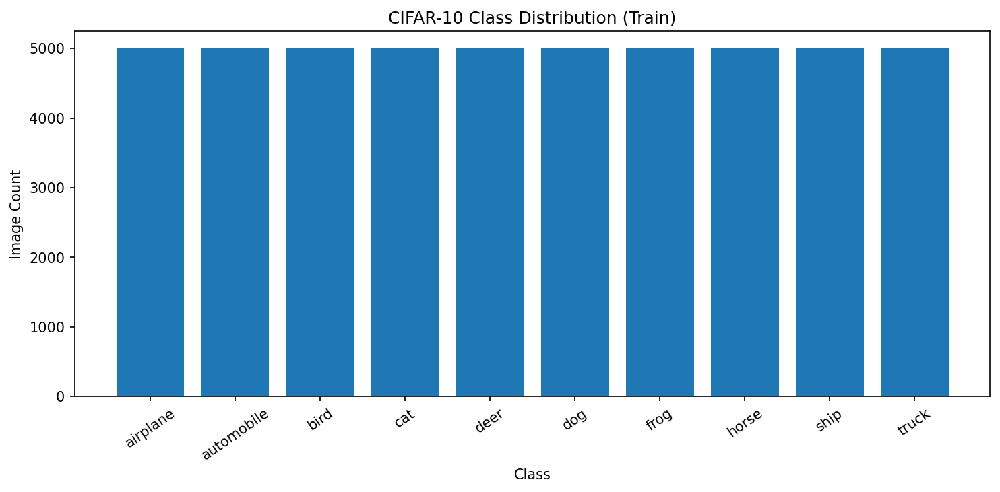
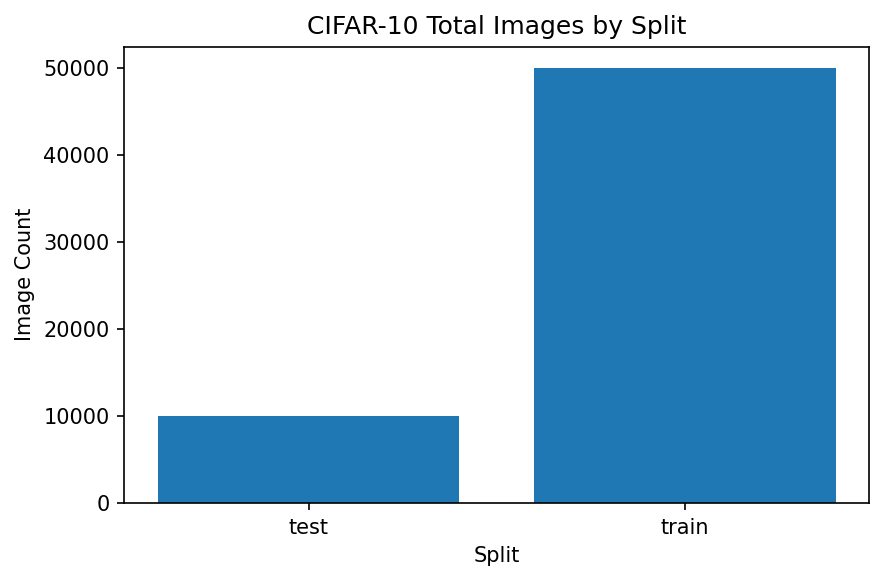
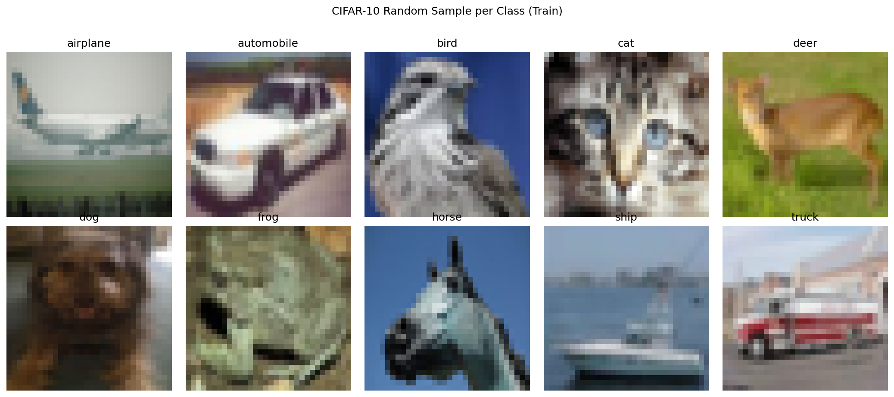

# shahpk1 CIFAR-10 Data Analysis Final Results

## Methods

- Performed folder-based scan of CIFAR-10 train/test directories.
- Counted valid image files per class and split.
- Generated distribution plots and a random sample image grid.

## Key Results

- Number of classes: **10**
- Total training images: **50000**
- Total test images: **10000**
- Total images overall: **60000**
- Each image is 32x32 pixels with 3 color channels (RGB).

### Class Count Table

| class_name | test | train | total |
| --- | --- | --- | --- |
| airplane | 1000 | 5000 | 6000 |
| automobile | 1000 | 5000 | 6000 |
| bird | 1000 | 5000 | 6000 |
| cat | 1000 | 5000 | 6000 |
| deer | 1000 | 5000 | 6000 |
| dog | 1000 | 5000 | 6000 |
| frog | 1000 | 5000 | 6000 |
| horse | 1000 | 5000 | 6000 |
| ship | 1000 | 5000 | 6000 |
| truck | 1000 | 5000 | 6000 |

## Plots

- Train class distribution:

- Test class distribution:

- Split totals:

- Train sample grid:

## Conclusion

- CIFAR-10 appears class-balanced within each split based on image counts.
- It also looks like there is good diversity in the sample grid across all classes.
- This analysis provides a good foundation for understanding the dataset before training classifiers.
